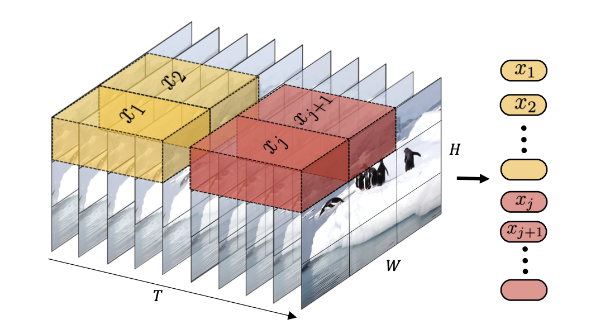

Pytorch implementation for ViViT using Tubelet Embedding.

If you are not already familiar with vision transformer, please head over to [this](https://github.com/mnauf/vision-transformer-pytorch-implementation) repo where I have implemented vision transformer.